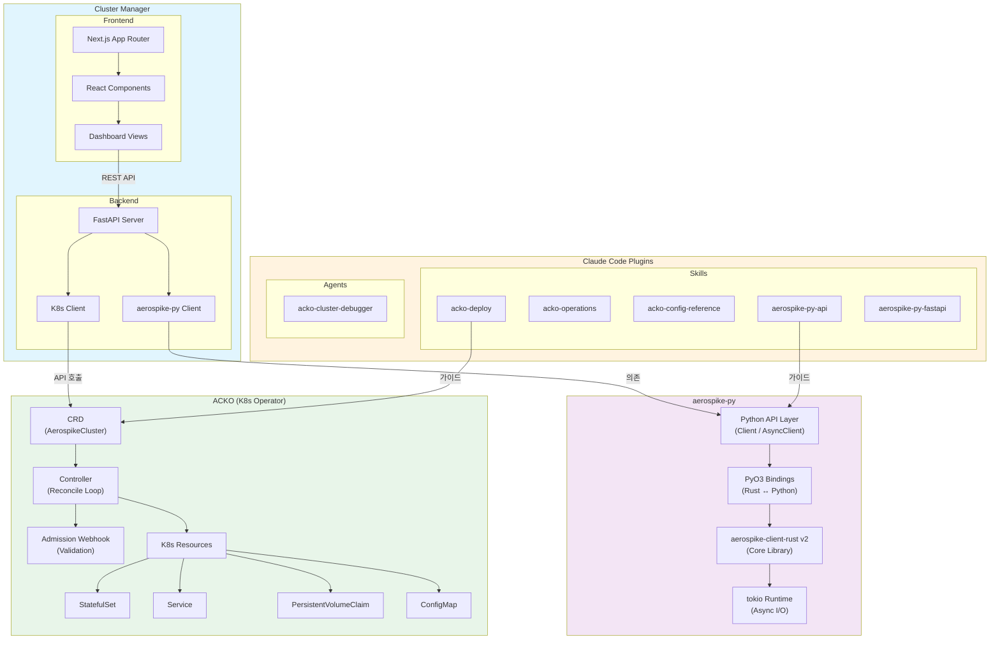
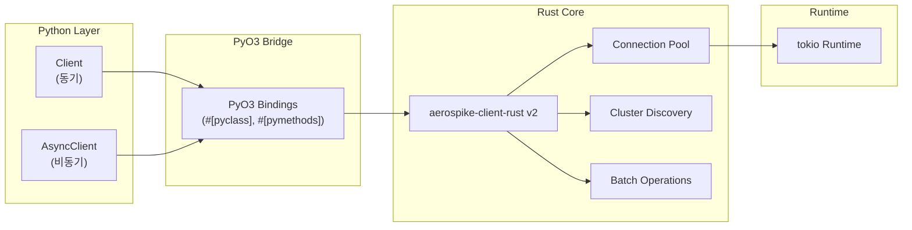
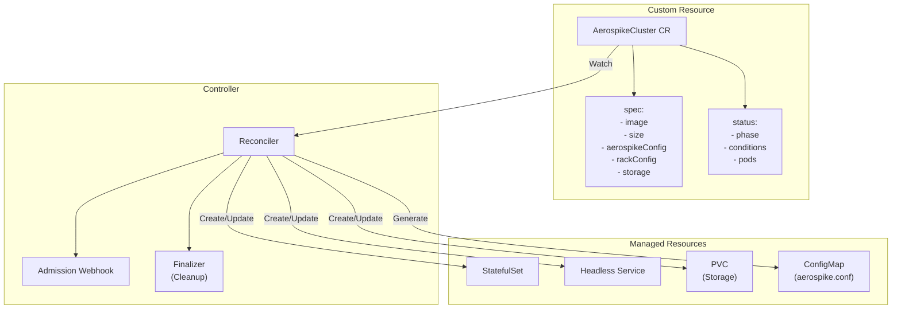
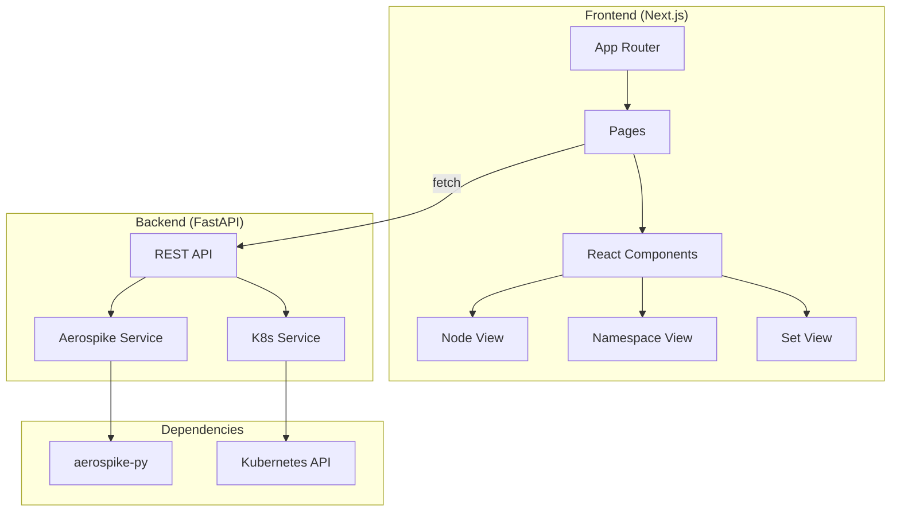

# Component Diagram

각 레포지토리의 내부 구조와 컴포넌트 간 관계를 보여줍니다.

## 전체 컴포넌트 다이어그램

## 레포별 상세 구조

### aerospike-py

Rust 기반 고성능 Aerospike Python 클라이언트입니다.

| 컴포넌트 | 역할 |
|----------|------|
| Python API Layer | `Client` (동기) / `AsyncClient` (비동기) 인터페이스 제공 |
| PyO3 Bindings | Rust 코드를 Python에서 호출 가능하게 변환 |
| aerospike-client-rust v2 | 핵심 Aerospike 프로토콜 구현 (연결 관리, 클러스터 디스커버리, 배치 처리) |
| tokio Runtime | 비동기 I/O 런타임으로 높은 동시성 지원 |

### ACKO (Aerospike CE Kubernetes Operator)

Kubernetes 위에서 Aerospike CE 클러스터를 선언적으로 관리하는 Operator입니다.

| 컴포넌트 | 역할 |
|----------|------|
| AerospikeCluster CRD | 클러스터의 원하는 상태를 선언적으로 정의 |
| Controller (Reconciler) | CR 변경 감지 후 실제 상태를 원하는 상태로 수렴 |
| Admission Webhook | CR 생성/수정 시 CE 제약 조건 검증 |
| StatefulSet | 안정적인 네트워크 ID와 순차적 배포 보장 |
| Headless Service | Pod 간 직접 DNS 해결 |
| PVC | 영구 스토리지 관리 |
| ConfigMap | aerospike.conf 자동 생성 |

### Cluster Manager

웹 기반 Aerospike 클러스터 관리 UI입니다.

| 컴포넌트 | 역할 |
|----------|------|
| Next.js Frontend | App Router 기반 SPA, 클러스터 상태 시각화 |
| React Components | 노드, Namespace, Set 등의 뷰 컴포넌트 |
| FastAPI Backend | REST API 서버, 비즈니스 로직 처리 |
| Aerospike Service | aerospike-py를 사용한 데이터 접근 계층 |
| K8s Service | Kubernetes API를 통한 클러스터 관리 기능 |

### Claude Code Plugins

Claude Code에서 Aerospike CE Ecosystem 개발 생산성을 높이는 Skill과 Agent입니다.

| 분류 | 이름 | 설명 |
|------|------|------|
| **Skill** | `acko-deploy` | ACKO를 통한 Aerospike K8s 배포 가이드 |
| **Skill** | `acko-operations` | 기존 Aerospike K8s 클러스터 운영/디버깅 |
| **Skill** | `acko-config-reference` | Aerospike CE 8.1 설정 파라미터 레퍼런스 |
| **Skill** | `aerospike-py-api` | aerospike-py Python API 사용 가이드 |
| **Skill** | `aerospike-py-fastapi` | FastAPI + aerospike-py 통합 패턴 |
| **Agent** | `acko-cluster-debugger` | Aerospike K8s 클러스터 문제 자율 디버깅 |
