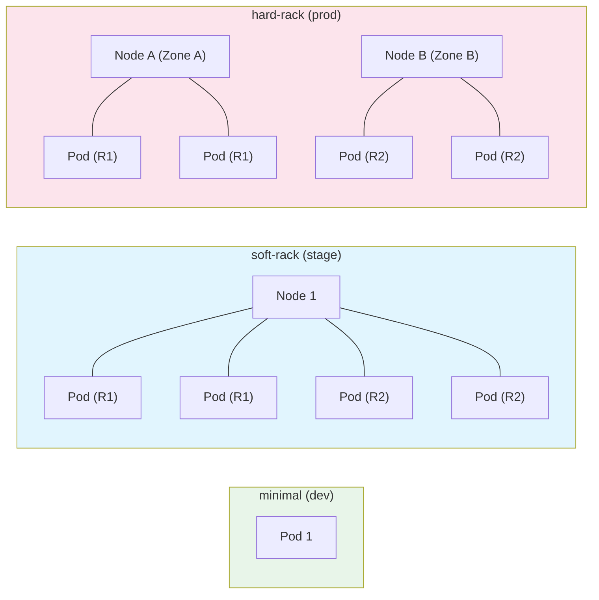

# Deployment Topology

Aerospike CE Ecosystem의 배포 환경을 로컬 개발부터 프로덕션까지 단계별로 설명합니다.

## 환경별 토폴로지

```mermaid
graph TB
    subgraph Local["로컬 개발 환경"]
        Podman["Podman Compose"]
        CMLocal["Cluster Manager"]
        AeroLocal["Aerospike Server CE<br/>(1 Node)"]
        Podman --> CMLocal
        Podman --> AeroLocal
        CMLocal -->|aerospike-py| AeroLocal
    end

    subgraph K8sDev["K8s 개발 환경 (minimal)"]
        ACKO1["ACKO"]
        STS1["StatefulSet<br/>(1 Replica)"]
        Pod1["Aerospike Pod"]
        ACKO1 --> STS1
        STS1 --> Pod1
    end

    subgraph K8sStage["K8s 스테이징 환경 (soft-rack)"]
        ACKO2["ACKO"]
        STS2["StatefulSet<br/>(N Replicas)"]
        Pod2a["Pod (Rack 1)"]
        Pod2b["Pod (Rack 2)"]
        Node2["1 Node"]
        ACKO2 --> STS2
        STS2 --> Pod2a
        STS2 --> Pod2b
        Pod2a --> Node2
        Pod2b --> Node2
    end

    subgraph K8sProd["K8s 프로덕션 환경 (hard-rack)"]
        ACKO3["ACKO"]
        STS3["StatefulSet<br/>(N Replicas)"]
        Pod3a["Pod (Rack 1)"]
        Pod3b["Pod (Rack 2)"]
        Node3a["Node A"]
        Node3b["Node B"]
        ACKO3 --> STS3
        STS3 --> Pod3a
        STS3 --> Pod3b
        Pod3a --> Node3a
        Pod3b --> Node3b
    end

    style Local fill:#fff3e0
    style K8sDev fill:#e8f5e9
    style K8sStage fill:#e1f5fe
    style K8sProd fill:#fce4ec
```



## 로컬 개발 환경

Podman Compose를 사용하여 Cluster Manager와 Aerospike Server를 로컬에서 실행합니다.

### 구성

| 서비스 | 이미지 | 포트 |
|--------|--------|------|
| Cluster Manager Frontend | `cluster-manager-frontend` | 3000 |
| Cluster Manager Backend | `cluster-manager-backend` | 8000 |
| Aerospike Server CE | `aerospike/aerospike-server-ce` | 3000-3003 |

### 실행 방법

```bash
# Podman Compose로 전체 스택 실행
podman compose up -d

# 상태 확인
podman compose ps

# 로그 확인
podman compose logs -f aerospike
```

:::info Podman 사용
이 프로젝트는 Podman을 컨테이너 런타임으로 사용합니다. Rootless 컨테이너, 데몬 불필요, OCI 호환 등의 장점이 있습니다. 자세한 내용은 [ADR-0003](./adr/podman-over-docker.md)을 참고하세요.
:::

## Kubernetes 배포 (ACKO)

ACKO(Aerospike CE Kubernetes Operator)를 통해 `AerospikeCluster` CRD로 선언적 배포를 수행합니다.

### 배포 템플릿

#### 1. minimal (개발용)

가장 간단한 구성으로, 단일 Aerospike Pod를 배포합니다.

```yaml
apiVersion: acko.aerospike-ce-ecosystem.io/v1alpha1
kind: AerospikeCluster
metadata:
  name: aerospike-dev
spec:
  size: 1
  image: aerospike/aerospike-server-ce:8.1
  aerospikeConfig:
    namespaces:
      - name: test
        memorySize: 1Gi
        replicationFactor: 1
        storage:
          type: memory
```

| 항목 | 값 |
|------|-----|
| 용도 | 개발, 테스트 |
| 노드 수 | 1 |
| Rack 구성 | 없음 |
| 스토리지 | Memory |
| Replication Factor | 1 |

#### 2. soft-rack (스테이징)

1개의 Kubernetes Node에 여러 Aerospike Pod를 배포하되, 논리적 Rack으로 분리합니다.

```yaml
apiVersion: acko.aerospike-ce-ecosystem.io/v1alpha1
kind: AerospikeCluster
metadata:
  name: aerospike-stage
spec:
  size: 4
  image: aerospike/aerospike-server-ce:8.1
  rackConfig:
    racks:
      - id: 1
      - id: 2
  aerospikeConfig:
    namespaces:
      - name: app
        memorySize: 4Gi
        replicationFactor: 2
        storage:
          type: device
          devices:
            - /dev/sdb
```

| 항목 | 값 |
|------|-----|
| 용도 | 스테이징, 통합 테스트 |
| 노드 수 | 1 Node, N Pod |
| Rack 구성 | 논리적 Rack (soft) |
| 스토리지 | Device (PVC) |
| Replication Factor | 2 |

#### 3. hard-rack (프로덕션)

N개의 Kubernetes Node에 Aerospike Pod를 분산 배포하여 물리적 장애 도메인을 보장합니다.

```yaml
apiVersion: acko.aerospike-ce-ecosystem.io/v1alpha1
kind: AerospikeCluster
metadata:
  name: aerospike-prod
spec:
  size: 6
  image: aerospike/aerospike-server-ce:8.1
  rackConfig:
    racks:
      - id: 1
        zone: zone-a
        nodeAffinity:
          matchExpressions:
            - key: topology.kubernetes.io/zone
              operator: In
              values: [zone-a]
      - id: 2
        zone: zone-b
        nodeAffinity:
          matchExpressions:
            - key: topology.kubernetes.io/zone
              operator: In
              values: [zone-b]
  aerospikeConfig:
    namespaces:
      - name: app
        memorySize: 8Gi
        replicationFactor: 2
        storage:
          type: device
          devices:
            - /dev/sdb
```

| 항목 | 값 |
|------|-----|
| 용도 | 프로덕션 |
| 노드 수 | N Node, N Pod |
| Rack 구성 | 물리적 Rack (hard), Zone Affinity |
| 스토리지 | Device (PVC) |
| Replication Factor | 2 |

### 템플릿 비교



## Aerospike CE 제약 사항

Aerospike Community Edition(CE)에는 Enterprise Edition(EE) 대비 다음과 같은 제약이 있습니다. ACKO는 이 제약 사항을 Admission Webhook에서 검증합니다.

| 제약 사항 | CE 제한 | EE |
|-----------|---------|-----|
| **최대 노드 수** | 8개 | 무제한 |
| **최대 Namespace 수** | 2개 | 무제한 |
| **XDR (Cross-Datacenter Replication)** | 불가 | 가능 |
| **TLS** | 불가 | 가능 |
| **Security (인증/권한)** | 불가 | 가능 |
| **Feature Key** | 불필요 | 필수 |

:::warning CE 제약 주의
CR에 `security`, `tls`, `xdr` 설정을 포함하면 Aerospike CE Pod가 시작에 실패합니다. ACKO의 Admission Webhook이 이를 사전에 차단합니다.

`feature-key-file` 설정도 CE에서는 불필요하며, 포함 시 Pod crash가 발생합니다.
:::
