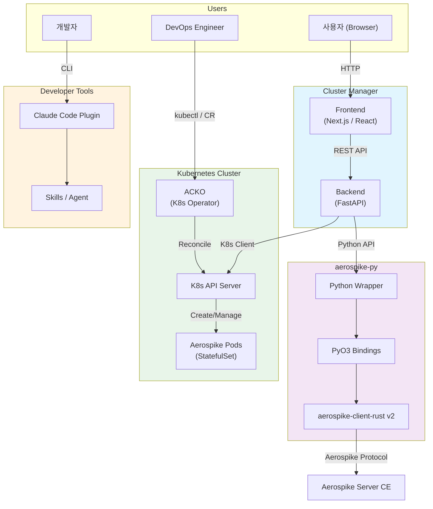
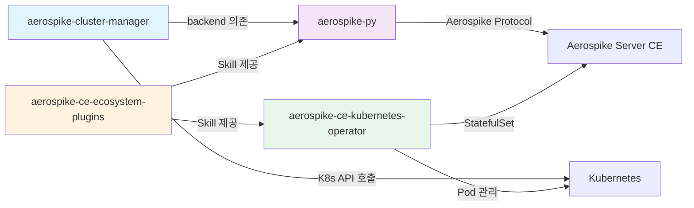

# System Architecture Overview

Aerospike CE Ecosystem은 4개의 핵심 레포지토리로 구성되며, 각각 독립적으로 배포되면서도 유기적으로 연결됩니다.

## 전체 시스템 다이어그램

## 핵심 흐름

### 1. 사용자 데이터 흐름

사용자가 Cluster Manager UI를 통해 Aerospike 데이터를 조회/수정하는 흐름입니다.

1. **Browser** -- Cluster Manager Frontend (Next.js)에 접속
2. **Frontend** -- Backend (FastAPI) REST API 호출
3. **Backend** -- aerospike-py 클라이언트로 Aerospike Server에 쿼리
4. **aerospike-py** -- PyO3를 통해 Rust aerospike-client-rust v2로 네이티브 통신

### 2. Kubernetes 배포 흐름

DevOps 엔지니어가 ACKO를 통해 Aerospike 클러스터를 배포하는 흐름입니다.

1. **DevOps** -- `AerospikeCluster` Custom Resource 적용 (`kubectl apply`)
2. **ACKO Controller** -- CR 변경 감지 후 Reconcile 루프 실행
3. **K8s API** -- StatefulSet, Service, PVC 등 리소스 생성/업데이트
4. **Aerospike Pods** -- 자동 클러스터링 및 서비스 시작

### 3. 개발자 도구 흐름

개발자가 Claude Code Plugin을 통해 생산성을 높이는 흐름입니다.

1. **Developer** -- Claude Code CLI에서 Plugin 사용
2. **Plugin** -- 상황에 맞는 Skill (acko-deploy, aerospike-py-api 등) 활성화
3. **Agent** -- 복잡한 디버깅 등을 자율적으로 수행 (acko-cluster-debugger)

## 레포 간 의존성

| 의존 관계 | 설명 |
|-----------|------|
| `cluster-manager` -> `aerospike-py` | Backend가 aerospike-py를 Python 클라이언트로 사용하여 Aerospike Server와 통신 |
| `ACKO` -> Kubernetes | Kubernetes 위에서 Aerospike Pod를 StatefulSet으로 관리 |
| `plugins` -> `aerospike-py`, `ACKO` | Claude Code Skill을 통해 aerospike-py API 가이드와 ACKO 배포 가이드 제공 |
| `cluster-manager` -> Kubernetes API | Frontend에서 K8s 클러스터 상태 조회 가능 |

## 기술 스택 요약

| 레포 | 언어/프레임워크 | 핵심 기술 |
|------|----------------|----------|
| aerospike-py | Rust + Python | PyO3, tokio, aerospike-client-rust v2 |
| ACKO | Go | Kubebuilder v4, controller-runtime, client-go |
| cluster-manager | TypeScript + Python | Next.js, React, FastAPI, aerospike-py |
| plugins | Markdown + YAML | Claude Code Skills, Agents |
