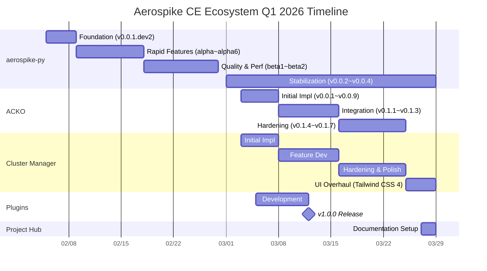

# Project Timeline

Aerospike CE Ecosystem의 전체 프로젝트 타임라인과 주요 이정표를 정리합니다. 2026년 2월 5일 첫 커밋부터 현재까지의 개발 과정을 시간순으로 기록합니다.

---

## Visual Timeline

---

## Phase 1: aerospike-py Foundation

**2026-02-05 ~ 2026-02-09** | 5 days

에코시스템의 첫 프로젝트인 aerospike-py가 시작됩니다.

| Date | Event | Details |
|------|-------|---------|
| 02-05 | Initial commit | Apache-2.0 라이선스, Rust/PyO3 0.28 코어 구현 |
| 02-05 | CI/CD setup | tox-uv, maturin 빌드, PyPI trusted publishing |
| 02-06 | Docusaurus docs | 문서 사이트 초기 구축 |
| 02-07 | Basic CRUD | put, get, delete, exists 기본 연산 |
| 02-08 | **v0.0.1.dev2 release** | 첫 번째 릴리스, 기본 기능 검증 |

**핵심 결정**: Rust/PyO3 over CFFI ([ADR-0001](/docs/architecture/adr/pyo3-over-cffi))

---

## Phase 2: aerospike-py Rapid Feature Development

**2026-02-09 ~ 2026-02-18** | 10 days

핵심 기능을 빠르게 구현하여 alpha 릴리스를 반복합니다.

| Date | Event | Details |
|------|-------|---------|
| 02-09 | CDT operations | List/Map operations, nested CDT, CTX path |
| 02-10 | Expression filters | exp 모듈, 복합 predicate 구성 |
| 02-10 | **v0.0.1.alpha** | CDT + expression 포함 첫 alpha |
| 02-11 | Async client | AsyncClient, Tokio-based async runtime |
| 02-12 | OpenTelemetry | 분산 추적 통합 |
| 02-12 | **v0.0.1.alpha3** | Async + OTel 포함 |
| 02-13 | Prometheus metrics | get_metrics() endpoint, counter/histogram |
| 02-14 | Structured logging | 구성 가능한 로그 레벨, JSON 포맷 |
| 02-14 | **v0.0.1.alpha4** | Observability stack 완성 |
| 02-15 | NamedTuple type system | record.bins, record.meta.gen 패턴 정립 |
| 02-16 | .pyi type stubs | 전체 API 타입 힌트 |
| 02-17 | NumPy batch operations | batch_read_numpy, batch_write_numpy |
| 02-17 | Bug report logging | 자동 진단 정보 수집 |
| 02-17 | Info commands | Aerospike info protocol 지원 |
| 02-17 | **v0.0.1.alpha6** | Type system + NumPy 통합 |

**하이라이트**: 10일 만에 4개 alpha 릴리스, 핵심 기능 대부분 구현

---

## Phase 3: aerospike-py Quality & Performance

**2026-02-18 ~ 2026-02-28** | 11 days

성능 최적화와 품질 향상에 집중합니다.

| Date | Event | Details |
|------|-------|---------|
| 02-18 | Double GIL elimination | Python GIL 이중 획득 제거, 성능 2x 향상 |
| 02-19 | Policy caching | Per-operation policy object 재사용 |
| 02-21 | **v0.0.1.beta1** | 성능 최적화 포함 첫 beta |
| 02-22 | CI hardening | Security audit, dependabot 설정 |
| 02-24 | Documentation i18n | EN/KO 이중언어 문서 완성 |
| 02-25 | Doc versioning | 릴리스별 문서 버전 관리 시스템 |
| 02-26 | Benchmark dashboard | 성능 비교 대시보드 구축 |
| 02-27 | **v0.0.1.beta2** | 품질 검증 완료, 안정화 |

**핵심 결정**: Performance-first 원칙 확립, GIL 최적화로 순수 Python 대비 10x+ 성능

---

## Phase 4: ACKO & Cluster Manager Launch

**2026-03-03 ~ 2026-03-08** | 6 days

에코시스템이 확장됩니다. ACKO와 Cluster Manager가 동시에 개발을 시작합니다.

| Date | Event | Details |
|------|-------|---------|
| 03-03 | ACKO initial commit | CRD, Controller skeleton, Go + Kubebuilder v4 |
| 03-03 | Cluster Manager initial commit | FastAPI backend + Next.js frontend |
| 03-03 | **ACKO v0.0.1** | 초기 CRD 정의 |
| 03-04 | ACKO webhook | CE 제약 검증 webhook 구현 |
| 03-04 | **ACKO v0.0.2~v0.0.3** | Webhook + Helm chart |
| 03-05 | CM wizard | 클러스터 생성 위자드 (9 -> 5 steps 최적화) |
| 03-05 | **ACKO v0.0.4~v0.0.5** | StatefulSet + Service 관리 |
| 03-06 | ACKO storage | PVC 관리, aerospike.conf 템플릿 |
| 03-06 | **ACKO v0.0.6~v0.0.7** | Storage + Config |
| 03-07 | ACKO E2E tests | Kind 기반 통합 테스트 프레임워크 |
| 03-07 | **ACKO v0.0.8~v0.0.9** | CE 제약 webhook + E2E |
| 03-08 | CM security | 인증/인가, 보안 설정 |

**하이라이트**: 6일 만에 ACKO 9개 릴리스, Cluster Manager MVP 완성

**핵심 결정**: Kubebuilder v4 ([ADR-0002](/docs/architecture/adr/kubebuilder-v4)), Podman ([ADR-0003](/docs/architecture/adr/podman-over-docker))

---

## Phase 5: Rapid Integration

**2026-03-08 ~ 2026-03-16** | 9 days

4개 프로젝트가 본격적으로 연동되는 시기입니다.

| Date | Event | Details |
|------|-------|---------|
| 03-08 | ACKO cluster-scoped templates | minimal, soft-rack, hard-rack 템플릿 |
| 03-09 | ACKO operator resilience | 장애 복구, 재시도 로직 강화 |
| 03-10 | **ACKO v0.1.1** | Cluster-scoped templates |
| 03-10 | CM event timeline | 11개 카테고리 이벤트 추적 |
| 03-11 | CM config drift detection | 설정 변경 감지 및 diff 뷰어 |
| 03-12 | ACKO unified Podman image | 단일 컨테이너 이미지 빌드 |
| 03-12 | ACKO monitoring | Prometheus ServiceMonitor 연동 |
| 03-12 | **ACKO v0.1.2** | Unified image + monitoring |
| 03-12 | **Plugins v1.0.0** | 5 skills, 1 agent, 8 examples, 13 docs |
| 03-13 | CM health monitoring | 실시간 클러스터 상태 모니터링 대시보드 |
| 03-14 | ACKO migration status | Pod 마이그레이션 상태 실시간 추적 |
| 03-14 | ACKO UI integration | cluster-manager git submodule 연동 |
| 03-14 | **ACKO v0.1.3** | Migration status + UI submodule |
| 03-15 | CM K8s operator integration | ACKO 연동 K8s 클러스터 관리 |
| 03-15 | CM template management | 클러스터 템플릿 CRUD UI |
| 03-15 | aerospike-py backpressure | BackpressureError, circuit breaker |
| 03-15 | aerospike-py refactoring | ~1200 lines 중복 코드 제거 |

**하이라이트**: Plugins v1.0.0 릴리스, 4개 프로젝트 첫 통합 릴리스 달성

---

## Phase 6: Hardening & Polish

**2026-03-16 ~ 2026-03-25** | 10 days

안정성 강화와 기능 고도화에 집중합니다.

| Date | Event | Details |
|------|-------|---------|
| 03-17 | ACKO stability hardening | Operator 안정성 강화 |
| 03-17 | **ACKO v0.1.4** | Stability hardening |
| 03-18 | CM unified cluster list | K8s + standalone 통합 클러스터 목록 |
| 03-19 | ACKO priority class | Pod 우선순위 설정 지원 |
| 03-19 | ACKO data safety | PVC 보호, 안전한 스케일다운 |
| 03-19 | **ACKO v0.1.5** | Priority class + data safety |
| 03-19 | aerospike-py BatchRecords | API unification, consolidated improvements |
| 03-19 | **aerospike-py v0.0.3** | BatchRecords API unification |
| 03-20 | CM clone functionality | 기존 클러스터 복제 기능 |
| 03-21 | CM config diff viewer | 설정 비교 시각화 |
| 03-22 | ACKO bilingual docs | EN/KO 완전한 이중언어 문서 |
| 03-22 | **ACKO v0.1.6** | Bilingual docs, Helm refinements |
| 03-23 | Agentic CI deployment | claude-code-action 전 프로젝트 배포 |
| 03-25 | **ACKO v0.1.7** | Final Q1 release, agentic CI |
| 03-26 | **aerospike-py v0.0.4** | Final Q1 release |

**하이라이트**: Agentic CI (claude-code-action) 전 프로젝트 배포 완료

---

## Phase 7: UI Overhaul & Project Hub

**2026-03-25 ~ 2026-03-29** | 5 days

Cluster Manager의 대규모 UI 전환과 프로젝트 허브 생성.

| Date | Event | Details |
|------|-------|---------|
| 03-25 | DaisyUI removal (PR #153) | DaisyUI 의존성 완전 제거 결정 |
| 03-26 | Pure Tailwind CSS 4 | 유틸리티 퍼스트 리디자인 |
| 03-27 | 14 Radix-based primitives | 접근성 기반 커스텀 컴포넌트 구축 |
| 03-28 | OOM prevention | 메모리 사용량 제어 |
| 03-28 | Read/write timeouts | 대용량 데이터 안정성 확보 |
| 03-29 | **Project Hub creation** | Docusaurus 기반 통합 문서 사이트 |

**핵심 결정**: DaisyUI -> Pure Tailwind CSS 4 전환, Radix UI primitives 자체 구축

---

## Summary Statistics

| Metric | Value |
|--------|:-----:|
| 총 개발 기간 | 53 days (Feb 5 - Mar 29) |
| 프로젝트 수 | 4 repos + 1 hub |
| 총 릴리스 수 | 28 releases |
| aerospike-py | 178 PRs, 4 releases (v0.0.1-v0.0.4), ~377 commits |
| ACKO | 200+ PRs, 17 releases (v0.0.1-v0.1.7), ~378 commits |
| Cluster Manager | 155+ PRs, active development |
| Plugins | 1.0.0 release (5 skills + 1 agent) |
| 총 PR 수 | 530+ |
| ACKO 릴리스 속도 | 17 releases / 27 days |
| aerospike-py 릴리스 속도 | 14 releases / 50 days |

---

## Key Decisions Timeline

| Date | Decision | Reference |
|------|----------|-----------|
| 2026-02-05 | Rust/PyO3 over CFFI | [ADR-0001](/docs/architecture/adr/pyo3-over-cffi) |
| 2026-03-03 | Kubebuilder v4 for ACKO | [ADR-0002](/docs/architecture/adr/kubebuilder-v4) |
| 2026-03-03 | Podman over Docker | [ADR-0003](/docs/architecture/adr/podman-over-docker) |
| 2026-03-05 | FastAPI + Next.js for CM | Performance + DX |
| 2026-03-12 | Claude Code Plugins | AI-assisted development |
| 2026-03-25 | DaisyUI -> Tailwind CSS 4 | Customization + control |
| 2026-02-15 | NamedTuple over Dict | [ADR-0004](/docs/architecture/adr/namedtuple-over-dict) |
| 2026-03-08 | Cluster-scoped Template | [ADR-0007](/docs/architecture/adr/cluster-scoped-template) |
| 2026-03-16 | Semaphore Backpressure | [ADR-0006](/docs/architecture/adr/backpressure-semaphore) |
| 2026-03-25 | DaisyUI -> Tailwind CSS 4 | [ADR-0005](/docs/architecture/adr/daisyui-removal) |
| 2026-03-02 | CRD Rename: AerospikeCluster | [ADR-0011](/docs/architecture/adr/crd-rename-aerospikecluster) |
| 2026-03-01 | Pod Readiness Gates | [ADR-0012](/docs/architecture/adr/pod-readiness-gates) |
| 2026-03-02 | Reconciliation Circuit Breaker | [ADR-0013](/docs/architecture/adr/reconciliation-circuit-breaker) |
| 2026-02-26 | SQLite → PostgreSQL Migration | [ADR-0014](/docs/architecture/adr/postgresql-migration) |
| 2026-03-02 | asinfo 기반 Health Check | [ADR-0015](/docs/architecture/adr/asinfo-health-checks) |
| 2026-03-29 | Project Hub (Docusaurus) | Centralized documentation |
